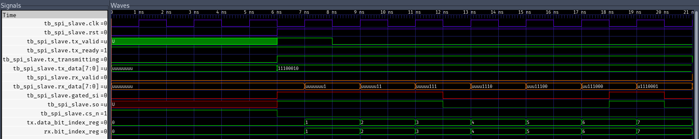

# Gtkwave TCL generator
This is a simple generator of tcl files that may be used along with gtkwave.
The generator generates tcl according to a testbench file, with rules that may be
specified inside of comments.

## Usage (vhdl code)
Signals are parsed one by one, their order is respected. They may be omitted using the `omit`.

Comments inside of architecture declaration (between `is` and `begin` keywords)
will be parsed. Standalone comments update the current context, this may be useful
to specify color of multiple signals that will follow.
To reset the color, format to default, use the `reset`.

Comments that are associated with a signal (the comment is at the same line as the semicolon),
are treated as associated with the given signal (or signals if the declaration declares multiple
signals).
These do not update the current context.

## Usage (cli)

The generator works as a cli. Folder with the testbenches, name of the testbench,
and output tcl file must be specified for proper operation.

```
Usage: gtkwave_tcl_generator --folder <FOLDER> --testbench <TESTBENCH> --output <OUTPUT>

Options:
  -f, --folder <FOLDER>
  -t, --testbench <TESTBENCH>
  -o, --output <OUTPUT>
  -h, --help                   Print help
  -V, --version                Print version
```

## Supported comment 'keywords'
| token      | values                                                          | description                                                          |
|------------|-----------------------------------------------------------------|----------------------------------------------------------------------|
| reset      | None                                                            | Reset current context.                                               |
| omit       | None                                                            | Omit the signals (not respected for "add signal").                   |
| color      | normal, red, orange, yellow, green, blue, indigo, violet, cycle | Sets the color of the signal.                                        |
| format     | hex, decimal signed decimal, binary                             | Sets the display format.                                             |
| add signal | path to the signal                                              | Adds the given signal, use dot notation. Separate options with comma |

# Example usage

This is architecture declaration for a testbench of `spi_slave` component.
``` vhdl
architecture tb of tb_spi_slave is
  -- color indigo
  signal clk : std_logic := '0';
  signal rst : std_logic := '0';

  -- color green
  signal tx_valid, tx_ready, tx_transmitting : std_logic;
  signal tx_data : std_logic_vector(7 downto 0);

  -- color orange
  signal rx_valid : std_logic;
  signal rx_data : std_logic_vector(7 downto 0);
  -- reset

  signal gated_si : std_logic; -- color red
  signal so : std_logic;
  signal cs_n : std_logic := '1';

  -- omit
  signal loopback : std_logic := '0';
  signal si : std_logic := '0';

  -- add signal uut.tx.data_bit_index_reg
  -- add signal uut.rx.bit_index_reg
begin  -- architecture tb
```

To generate a tcl, use: `gtkwave_tcl_generator --folder testbenches --testbench tb_spi_slave --output spi_slave.tcl`.
This will generate a tcl script. This script will add all of the signals that are not omitted using `omit`,
with the colors specified.

The result inside of gtkwave:

